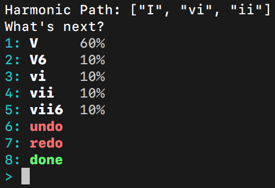

# Harmonic Network


Find your way through a network of harmony.

## Products

### harmonic-network

`harmonic-network` is a command line interface which allows you to incrementally build up a chord progression that is backed behind the industry-leading Johann Sebastian Bach technology.



#### Usage

Once you have [built the executable](#Installation), run the `harmonic-network` program by calling it up from the `.build/debug` directory

```bash
./.build/debug/harmonic-network
```

You will start on the `Tonic` (`I`) chord, and you will be prompted to choose the next chord from a list of options.

```bash
Let's start on the Tonic: ["I"]
What's next?
1: ii    10%
2: ii6   20%
3: IV    10%
4: IV6   20%
5: V     30%
6: V6    20%
7: vi    10%
8: done
>
```

Type in the number of the option you want, and press return.

For example, if you choose option `4`, you will have chosen the `IV6` chord. You will be happy that you did. The following prompt will be displayed.

```bash
Harmonic Path: ["I", "IV6"]
What's next?
1: I     17%
2: V     17%
3: V6    30%
4: I64   25%
5: vi    17%
6: undo
7: done
>
```
Your accumulated path is shown at the top (`["I", "IV6"]`). The percentages to the right of the roman numeral chord labels are the probabilities that J.S. Bach would have chosen the given harmony.

At any time, you can select the `done` option to complete your mission, and spit out the path that you have chosen.

```bash
All done: ["I", "IV6", "V6", "vi", "ii", "V", "I"]
```

Furthermore, you have the option of `undo`-ing and `redo`-ing any choices that you have made. Kids today have it so easy.


##### `--one-shot (-o)`

The `--one-shot` flag (`-o` for short) tells the program that you only want to create a single tonic progression. That is to say, as soon as you get to the tonic (`I`) chord again, the game's up.

If you don't call the `--one-shot` flag, you will choose new harmonies for the rest of eternity, or until you select the `done` option, your laptop battery runs out, or until the heat death of the universe. Your call.

##### Installation

To download the `harmonic-network` program, navigate to your directory of choice and clone the repository:

```bash
git clone https://github.com/jsbean/HarmonicNetwork && cd HarmonicNetwork
```

Then, build it

```bash
swift build
```

##### Requirements

To run `harmonic-network` in it's current state, you'll need the following:

- The Swift compiler on the Swift 5.1 development branch, which you can get
	- with any Xcode 11 beta,
	- or via a [toolchain](https://swift.org/download/#snapshots)
- MacOS 10.15 or Linux Ubuntu 14.04 / 16.04 / 18.04

(It may work on a less restrictive set of operating systems, but has not been tested as such.)

## Inspiration

This tool is inspired by the [chord-sequence-chooser](https://github.com/bwetherfield/chord-sequence-chooser) by
[@bwetherfield](https://github.com/bwetherfield).
